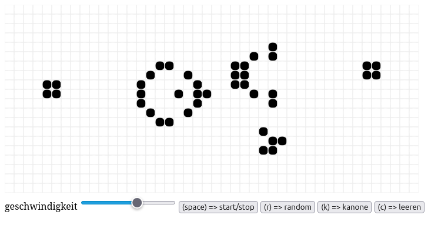

# Conway's Game of Life (MVC-Architektur)

Eine interaktive, performante Web-Implementierung von Conways „Spiel des Lebens“, entwickelt nach dem Entwurfsmuster Model-View-Controller (MVC) in purem JavaScript (ES6+). Die Simulation nutzt ein Canvas-Element für die Darstellung und implementiert ein unendliches Spielfeld in Form eines Torus.



## Entwicklung & Git-Historie

Dieses Projekt ist rein aus Spaß an der Freude und als persönliches Programmier-Experiment an einem Stück entstanden. Aus diesem Grund wurde auf das Aufsetzen eines Git-Repositories und eine detaillierte Commit-Historie verzichtet – der Fokus lag hier ganz auf dem reinen Basteln und Ausprobieren der MVC-Logik.


## Inhaltsverzeichnis
1. Features
2. Architektur & Dateistruktur
3. Steuerung & Tastaturkürzel
4. Installation & Start
5. Technische Details

---

## 1. Features

- **Torus-Spielfeld:** Zellen, die den Spielfeldrand verlassen, tauchen auf der gegenüberliegenden Seite wieder auf (Endlos-Spielfeld).
- **Dynamischer Zoom:** Stufenloses Vergrößern und Verkleinern des Gitters per Mausrad.
- **Responsive Design:** Das Spielfeld passt sich beim Verändern der Fenstergröße automatisch an.
- **Muster-Generator:** Direktes Platzieren einer funktionierenden Gosper Glider Gun (Gleiter-Kanone) im Zentrum des Feldes.
- **Interaktives Zeichnen:** Zellen können während des laufenden oder pausierten Betriebs per Mausklick ein- und ausgeschaltet werden.
- **Geschwindigkeitsregler:** Live-Anpassung der Simulationsgeschwindigkeit (FPS).

---

## 2. Architektur & Dateistruktur

Das Projekt ist streng nach dem MVC-Pattern (Model-View-Controller) aufgeteilt, um Datenlogik, Benutzeroberfläche und Eingabeverarbeitung sauber voneinander zu trennen:

- **`Model.js`**: Enthält den Zustand der Anwendung (das 2D-Array der Zellen, die Zellgröße und Dimensionen). Hier liegt die gesamte mathematische Logik für die Berechnung der Nachbarn, den Torus-Effekt, den Zoom und die Evolution der nächsten Generation.
- **`View.js`**: Verantwortlich für das Zeichnen auf dem HTML5-Canvas-Element sowie das Bereitstellen der UI-Komponenten (Buttons, Slider). Sie liest den Zustand des Models und rendert die lebenden Zellen.
- **`Controller.js`**: Das Bindeglied zwischen Model und View. Er fängt alle Benutzerinteraktionen ab (Mausklicks, Tastatureingaben, Fenster-Resizing, Slider-Bewegungen) und steuert die Simulationsschleife (`requestAnimationFrame`).
- **`index.html`**: Der Einstiegspunkt der Anwendung, der das Layout bereitstellt und die Skripte als ES6-Module lädt.

---

## 3. Steuerung & Tastaturkürzel

Die Simulation lässt sich sowohl über die grafischen Buttons auf der Oberfläche als auch über die Tastatur und die Maus steuern.

### Tastatur-Shortcuts
- **Leertaste (Space):** Simulation starten / pausieren
- **R / r:** Spielfeld mit zufälligen lebenden Zellen füllen (ca. 50% Dichte)
- **K / k:** Gosper Glider Gun (Gleiter-Kanone) in der Mitte platzieren
- **C / c:** Spielfeld komplett leeren und Simulation stoppen

### Maus- & UI-Interaktionen
- **Mausklick (auf das Spielfeld):** Wechselt den Zustand einer einzelnen Zelle (Zelle wird wiedergeboren oder stirbt).
- **Mausrad (Scrollen):** Vergrößert oder verkleinert die Zellen (Zoom In/Out).
- **Geschwindigkeits-Slider:** Reguliert die Berechnungszyklen pro Sekunde (FPS).

---

## 4. Installation & Start

Da das Projekt native JavaScript-Module (`import / export`) verwendet, blockieren moderne Browser das Laden aus dem lokalen Dateisystem (`file://`) aus Sicherheitsgründen (CORS-Richtlinie). Das Projekt muss daher über einen lokalen Webserver gestartet werden.

### Schritt-für-Schritt-Anleitung:

1. Klicke die Projektdateien in einen gemeinsamen Ordner.
2. Starte einen lokalen Webserver. Hier sind einige einfache Möglichkeiten:
   - **VS Code:** Installiere die Erweiterung **Live Server** und klicke unten rechts auf "Go Live".
   - **Node.js (npx):** Führe im Projektordner folgenden Befehl im Terminal aus:
     ```bash
     npx serve
     ```
   - **Python:** Führe folgenden Befehl im Terminal aus:
     ```bash
     python -m http.server 8000
     ```
3. Öffne den vom Server bereitgestellten Link (z. B. `http://localhost:8000` oder `http://127.0.0.1:5500`) in deinem Webbrowser.

---

## 5. Technische Details

### Die Game of Life Regeln
Das Model berechnet jede Generation basierend auf den klassischen Regeln von John Conway:
1. Eine lebende Zelle überlebt, wenn sie genau 2 oder 3 lebende Nachbarn hat.
2. Eine tote Zelle wird neu geboren, wenn sie exakt 3 lebende Nachbarn hat.
3. In allen anderen Fällen stirbt eine Zelle (Unterbevölkerung oder Überbevölkerung) oder bleibt tot.

### Mathematische Torus-Berechnung
Damit Zellen am Rand nicht abgeschnitten werden, nutzt die Nachbarschaftszählung eine Modulo-Operation. Dadurch wird das Gitter mathematisch zu einem Donut (Torus) gebogen:
```javascript
const c = (col + i + cols) % cols;
const r = (row + j + rows) % rows;
```

### Grid-Initialisierung
Um Referenzfehler im Speicher zu vermeiden und die Lesbarkeit zu wahren, wird das zweidimensionale Array über die `map`-Funktion instanziiert:
```javascript
this.grid = new Array(cols).fill(null).map(() => new Array(rows).fill(0));
```

---

